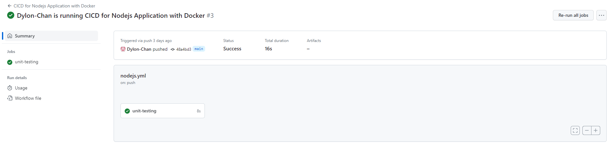
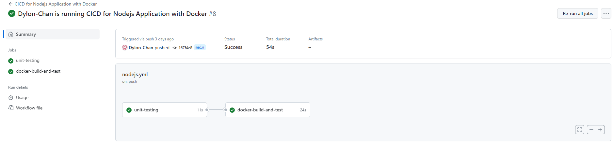
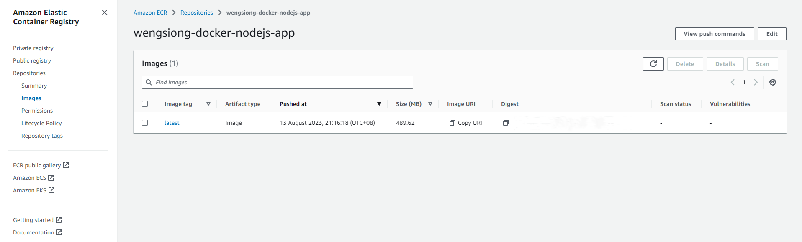
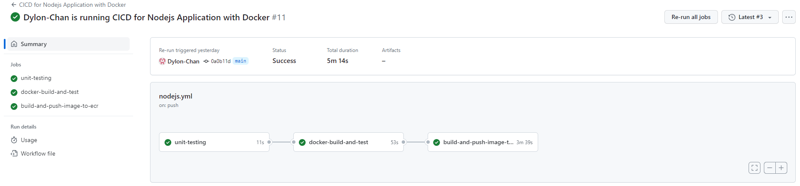
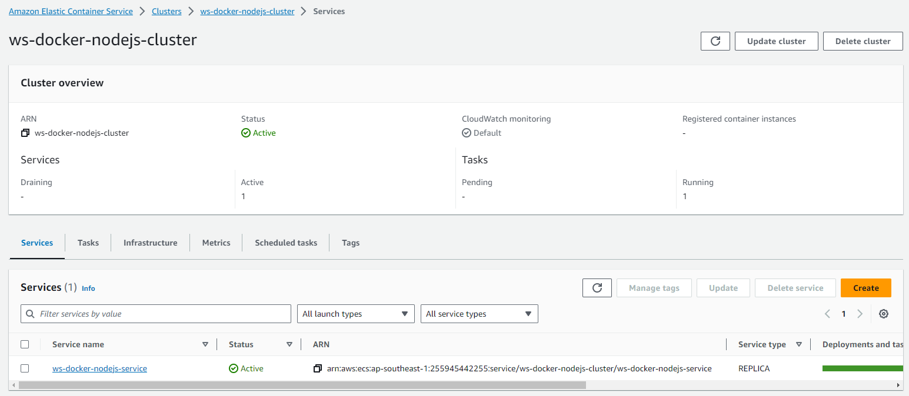
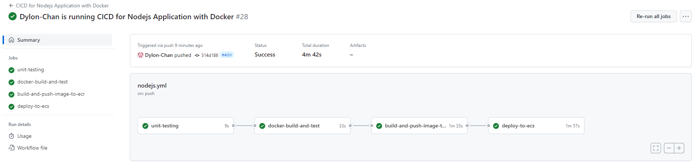
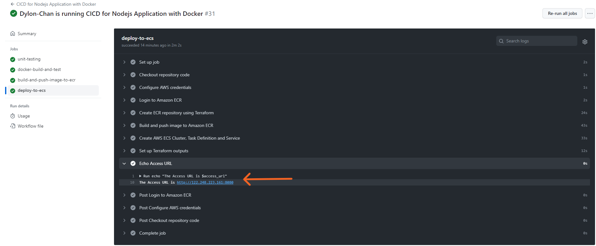
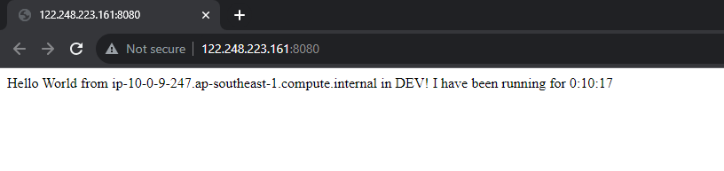

# CICD Pipeline for Containerized Nodejs Application in AWS

Welcome to a demonstration repository that showcases a continuous integration and continuous deployment (CICD) pipeline for a Node.js application, leveraging the Express framework. The application serves up a greeting message and displays the elapsed time since its initiation. Dive in to learn how we containerize this with Docker and subsequently deploy it on AWS ECS (Amazon Elastic Container Service).

## Table of Contents

- [Prerequisites](#prerequisites)
- [Nodejs Application](#nodejs-application)
- [CICD Pipeline](#cicd-pipeline)
- [Steps to Build and Set Up the CICD Pipeline](#steps-to-build-and-set-up-the-cicd-pipeline)
    - [Build the Nodejs Application](#build-the-nodejs-application)
    - [Build the Unit Test](#build-the-unit-test)
    - [Setup Github Action workflow](#setup-github-action-workflow)
    - [Create Docker image to containerize the Nodejs Application](#create-docker-image-to-containerize-the-nodejs-application)
    - [Unit Test Docker image at Github Action](#unit-test-docker-image-at-github-action)
    - [Create AWS ECR Private Repository using Terraform](#create-aws-ecr-private-repository-using-terraform)
    - [Push Docker image to AWS ECR using Github Action](#push-docker-image-to-aws-ecr-using-github-action)
    - [Create AWS ECS Cluster, Task Definition and Service using Terraform](#create-aws-ecs-cluster-task-definition-and-service-using-terraform)
    - [Deploy the Docker image from ECR to AWS ECS using Github Action](#deploy-the-docker-image-from-ecr-to-aws-ecs-using-github-action)
    - [Web Application Access](#web-application-access)
- [Troubleshooting](#troubleshooting)
- [Next Steps](#next-steps)
- [Conclusion](#conclusion)
- [References](#references)

## Prerequisites

Before getting started, ensure you have the following:
- Nodejs installed
- Docker
- Docker Desktop (Make sure it's running before executing Docker commands)
- AWS Account
- AWS credentials stored in Github Secrets (Access and Secret Access keys required)
- AWS CLI V2
- Terraform

## Nodejs Application

This application uses Express, a fast, unopinionated minimalist web framework for Node.js. The main functionality is to display a greeting message along with the time elapsed since the application started. The core logic can be found in the index.js and server.js files.


## CICD Pipeline

Leveraging the power of Github Actions and Terraform, our CICD pipeline comes to life when a commit is pushed to this repository. Here's a concise overview of the pipeline steps:

1. Build the Docker Image: Compiles the application and packages it within a Docker container.
2. Run Unit Tests: Ensures the application is error-free and behaves as expected.
3. Push the Docker image to AWS ECR: Ships the Docker image to AWS Elastic Container Registry.
4. Deploy the Docker image to AWS ECS: Deploys the containerized application on Amazon Elastic Container Service, making it accessible to users.

Once deployed, the web application can be accessed via the URL displayed in the workflow log.


## Steps to Build and Set Up the CICD Pipeline

### Build the Nodejs Application:

1. Start with the Node.js application in this repository or initialize a new one with the Express framework.
2. Navigate to the root directory of the repository and install the dependencies:
```bash
npm install       # Install the dependencies
npm install express  # Install the Express framework
npm init           # Create the package.json file
```
3. Create the `index.js` and `server.js` files with the codes found in the [index.js](./index.js) and [server.js](./server.js) in this repository or create your own Nodejs application.
4. Test locally:
    - Run `npm start` to start the application.
    - Open a browser and navigate to `http://localhost:8080` to view the application.

### Build the Unit Test:

1. Run the command below to install the testing framework.
```bash
npm install --save-dev jest supertest
```
2. Update the package.json file to add the test script.
```json
"scripts": {
    "test": "jest"
  },
```
3. Create the test file 'index.test.js' with the code found in the [index.test.js](./index.test.js) file in this repository or create your own test file.
4. Run the test locally:
    - Run `npm test` to run the test script which executes jest.

### Setup Github Action workflow:

1. Create the workflow YAML file: .github/workflows/nodejs.yml with the code below. This workflow will automatically install the dependencies, run the unit tests and report the test results.
```yml
name: CICD for Nodejs Application with Docker
run-name: ${{ github.actor }} is running CICD for Nodejs Application with Docker

on:
    push:
        branches: [ main, "*"]

jobs:
    unit-testing:
        runs-on: ubuntu-latest
        steps:
            - name: Checkout repository code
              uses: actions/checkout@v3
            - name: Setup Node.js
              uses: actions/setup-node@v3
              with:
                node-version: 18
            - name: Install dependencies
              run: npm ci
            - name: Run the unit tests
              run: npm run test
```
2. Push the workflow file to the repository.
```bash
git add .github/workflows/nodejs.yml
git commit -m "Add Github Actions workflow"
git push
```
3. Check and monitor the workflow status in the Actions tab of the repository.
4. You should see the workflow running and the test passed as shown below:



### Create Docker image to containerize the Nodejs Application:

1. Create the `Dockerfile` in the project root with the code found in the [Dockerfile](./Dockerfile) file in this repository.
2. Test the Dockerfile in local machine:
```bash
# Build the Docker image
docker build -t nodejs-app .

# Run the Docker image
docker run -d -p 8080:8080 nodejs-app
```
  - Open a browser and navigate to http://localhost:8080 to view the application.
  - Stop the docker container.
```bash
# Get the container ID
docker ps

# Stop the container
docker stop <container id>
```  

### Unit Test Docker image at Github Action:

1. Add `.dockerignore` into `.gitignore` file to prevent the `.dockerignore` file from being pushed to the repository.
2. Update the workflow YAML file by adding `docker-build-and-test` job. This job will build the Docker image and run the Docker image to test the application.
```yml
name: CICD for Nodejs Application with Docker
run-name: ${{ github.actor }} is running CICD for Nodejs Application with Docker

on:
    push:
        branches: [ main, "*"]

jobs:
    unit-testing:
        runs-on: ubuntu-latest
        steps:
            - name: Checkout repository code
              uses: actions/checkout@v3
            - name: Setup Node.js
              uses: actions/setup-node@v3
              with:
                node-version: 18
            - name: Install dependencies
              run: npm ci
            - name: Run the unit tests
              run: npm run test

    docker-build-and-test:
        runs-on: ubuntu-latest
        needs: unit-testing
        services:
            docker:
                image: docker:stable
                options: --privileged
        steps:
            - name: Checkout repository code
              uses: actions/checkout@v3
            - name: Build the Docker image
              run: docker build -t nodejs-app .
            - name: Run the docker image to test
              run: docker run -d -p 8080:8080 nodejs-app test
```
2. Push the workflow YAML file to the repository.
3. Check and monitor the workflow status in the Actions tab of the repository.
4. You should see the workflow running and the test passed as shown below:



### Create AWS ECR Private Repository using Terraform:

1. Create a new directory named "ecr" in the root directory of the repository.
2. Navigate to the "ecr" directory.
3. Create the terraform files: `ecr.tf`, `backend.tf` and `provider.tf` with the codes found in the [ecr](./ecr) directory in this repository.
- `ecr.tf` :
  - This terraform code creates the ECR repository.
- `backend.tf` :
  - This terraform code stores the terraform state file in AWS S3 bucket.
- `provider.tf` :
  - This terraform code configures the AWS provider.
4. Test the terraform files in local machine and check the ECR repository in AWS console:
```bash
terraform init      # Initialize the terraform
terraform plan      # Plan the terraform
terraform apply     # Apply the terraform
```



### Push Docker image to AWS ECR using Github Action:

1. Add `.terraform/` into `.gitignore` file to prevent the `.terraform/` directory from being pushed to the repository.
2. Update the workflow YAML file by adding `build-and-push-image-to-ecr` job. This job will create an ECR repository using Terraform, build the Docker image and push the Docker image to the ECR repository.
```yml
name: CICD for Nodejs Application with Docker
run-name: ${{ github.actor }} is running CICD for Nodejs Application with Docker

on:
    push:
        branches: [ main, "*"]

jobs:
    unit-testing:
        runs-on: ubuntu-latest
        steps:
            - name: Checkout repository code
              uses: actions/checkout@v3
            - name: Setup Node.js
              uses: actions/setup-node@v3
              with:
                node-version: 18
            - name: Install dependencies
              run: npm ci
            - name: Run the unit tests
              run: npm run test

    docker-build-and-test:
        runs-on: ubuntu-latest
        needs: unit-testing
        services:
            docker:
                image: docker:stable
                options: --privileged
        steps:
            - name: Checkout repository code
              uses: actions/checkout@v3
            - name: Build the Docker image
              run: docker build -t nodejs-app .
            - name: Run the docker image to test
              run: docker run -d -p 8080:8080 nodejs-app test

    build-and-push-image-to-ecr:
        runs-on: ubuntu-latest
        needs: docker-build-and-test
        steps:
            - name: Checkout repository code
              uses: actions/checkout@v3
            - name: Configure AWS credentials
              uses: aws-actions/configure-aws-credentials@v2
              with:
                aws-access-key-id: ${{ secrets.AWS_ACCESS_KEY_ID }}
                aws-secret-access-key: ${{ secrets.AWS_SECRET_ACCESS_KEY }}
                aws-region: ap-southeast-1
            - name: Login to Amazon ECR
              id: login-ecr
              uses: aws-actions/amazon-ecr-login@v1
            - name: Create ECR repository using Terraform
              run: |
                cd ecr
                terraform init
                terraform apply -auto-approve
            - name: Build and push image to Amazon ECR
              env: 
                ECR_REGISTRY: ${{ steps.login-ecr.outputs.registry }}
                ECR_REPOSITORY: wengsiong-docker-nodejs-app
                IMAGE_TAG: latest
              run: |
                docker build -t $ECR_REGISTRY/$ECR_REPOSITORY:$IMAGE_TAG .
                docker push $ECR_REGISTRY/$ECR_REPOSITORY:$IMAGE_TAG
```
3. Push the workflow YAML file to the repository.
4. Check and monitor the workflow status in the Actions tab of the repository.
5. You should see the workflow running and the test passed as shown below:



### Create AWS ECS Cluster, Task Definition and Service using Terraform:

1. Create a new directory named "ecs" in the root directory of the repository.
2. Navigate to the "ecs" directory.
3. Create the terraform files: `ecs.tf`, `backend.tf`, `provider.tf`, `variables.tf`, `output.tf` and `ecs-td-container-definition.json` with the codes found in the [ecs](./ecs) directory in this repository.
  - `ecs.tf` :
    - This terraform code creates the ECS cluster, task definition and service.
    - It also creates the security group for the ECS cluster service.
  - `backend.tf` : 
    - This terraform code stores the terraform state file in AWS S3 bucket.
  - `provider.tf` :
    - This terraform code configures the AWS provider.
  - `variables.tf` :
    - This terraform code defines the VPC ID and subnet ID which are used for the ECS cluster service.
  - `output.tf` :
    - This terraform code output the access URL of the web application by using ENI (Elastic Network Interface) ID of the security group for the ECS cluster service.
4. Test the terraform files in local machine:
```bash
terraform init      # Initialize the terraform
terraform plan      # Plan the terraform
terraform apply     # Apply the terraform
```
  - Check the ECS cluster, task definition and service in AWS console.
  - Delete the image in the ECR repository.
  - Destroy the terraform with the command below:
```bash
terraform destroy    # Destroy the terraform
```



### Deploy the Docker image from ECR to AWS ECS using Github Action:

1. Update the workflow YAML file by adding `deploy-to-ecs` job. This job will create an ECR repository using Terraform, build the Docker image and push the Docker image to the ECR repository. Then, it will create the ECS cluster, task definition and service using Terraform to deploy the Docker image. Finally, it will output the access URL for user to access the web application.
```yml
name: CICD for Nodejs Application with Docker
run-name: ${{ github.actor }} is running CICD for Nodejs Application with Docker

on:
    push:
        branches: [ main, "*"]

jobs:
    unit-testing:
        runs-on: ubuntu-latest
        steps:
            - name: Checkout repository code
              uses: actions/checkout@v3
            - name: Setup Node.js
              uses: actions/setup-node@v3
              with:
                node-version: 18
            - name: Install dependencies
              run: npm ci
            - name: Run the unit tests
              run: npm run test

    docker-build-and-test:
        runs-on: ubuntu-latest
        needs: unit-testing
        services:
            docker:
                image: docker:stable
                options: --privileged
        steps:
            - name: Checkout repository code
              uses: actions/checkout@v3
            - name: Build the Docker image
              run: docker build -t nodejs-app .
            - name: Run the docker image to test
              run: docker run -d -p 8080:8080 nodejs-app test

    build-and-push-image-to-ecr:
        runs-on: ubuntu-latest
        needs: docker-build-and-test
        steps:
            - name: Checkout repository code
              uses: actions/checkout@v3
            - name: Configure AWS credentials
              uses: aws-actions/configure-aws-credentials@v2
              with:
                aws-access-key-id: ${{ secrets.AWS_ACCESS_KEY_ID }}
                aws-secret-access-key: ${{ secrets.AWS_SECRET_ACCESS_KEY }}
                aws-region: ap-southeast-1
            - name: Login to Amazon ECR
              id: login-ecr
              uses: aws-actions/amazon-ecr-login@v1
            - name: Create ECR repository using Terraform
              run: |
                cd ecr
                terraform init
                terraform apply -auto-approve
            - name: Build and push image to Amazon ECR
              env: 
                ECR_REGISTRY: ${{ steps.login-ecr.outputs.registry }}
                ECR_REPOSITORY: wengsiong-docker-nodejs-app
                IMAGE_TAG: latest
              run: |
                docker build -t $ECR_REGISTRY/$ECR_REPOSITORY:$IMAGE_TAG .
                docker push $ECR_REGISTRY/$ECR_REPOSITORY:$IMAGE_TAG

    deploy-to-ecs:
        runs-on: ubuntu-latest
        needs: build-and-push-image-to-ecr
        steps:
            - name: Checkout repository code
              uses: actions/checkout@v3
            - name: Configure AWS credentials
              uses: aws-actions/configure-aws-credentials@v2
              with:
                aws-access-key-id: ${{ secrets.AWS_ACCESS_KEY_ID }}
                aws-secret-access-key: ${{ secrets.AWS_SECRET_ACCESS_KEY }}
                aws-region: ap-southeast-1
            - name: Login to Amazon ECR
              id: login-ecr
              uses: aws-actions/amazon-ecr-login@v1
            - name: Create ECR repository using Terraform
              run: |
                cd ecr
                terraform init
                terraform apply -auto-approve
            - name: Build and push image to Amazon ECR
              env: 
                ECR_REGISTRY: ${{ steps.login-ecr.outputs.registry }}
                ECR_REPOSITORY: wengsiong-docker-nodejs-app
                IMAGE_TAG: latest
              run: |
                docker build -t $ECR_REGISTRY/$ECR_REPOSITORY:$IMAGE_TAG .
                docker push $ECR_REGISTRY/$ECR_REPOSITORY:$IMAGE_TAG
            - name: Create AWS ECS Cluster, Task Definition and Service
              run: |
                cd ecs
                terraform init
                terraform apply -auto-approve -target=aws_ecs_cluster.ws-docker-nodejs-cluster -target=aws_ecs_task_definition.ws-docker-nodejs-td -target=aws_security_group.ecs-sg -target=aws_ecs_service.ws-docker-nodejs-service
            - name: Set up Terraform outputs
              id: tf-outputs
              working-directory: ./ecs
              run: |
                terraform apply -auto-approve
                echo "access_url=$(terraform output -json all_access_urls | jq -r 'to_entries[0].value')" >> $GITHUB_ENV
            - name: Echo Access URL
              run: echo "The Access URL is $access_url"
```
  - In the last part of the workflow, I have added a step named `Set up Terraform outputs`. This step is designed to ease the process of retrieving the access URL of the web application deployed through this workflow.
  - `terraform output` is a command that queries the outputs of the terraform state. Here, the `-json` flag to output the result in JSON format and the `all_access_urls` is the specific output variable we are interested in from Terraform's current state file.
  - `jq` is a lightweight and flexible command-line JSON processor. The `|` symbol is used to pipe the JSON output from the `terraform output` command to the `jq` command to parse the JSON output and `-r` tells `jq` to output the raw string instead of JSON string.
  - The `to_entries[0].value` is a `jq` filter that converts the JSON object into an array of key-value pairs and returns the value of the first entry in the array.
  - The `>>` symbol appends the output of the `echo` command to the `$GITHUB_ENV` file which is a special file that Github Actions uses to set environment variables for the subsequent steps in the job.
  - The environment variable `access_url` is then used in the next step to print the access URL of the web application to the console, allowing users to easily access the deployed web application.

2. Push the workflow YAML file to the repository.
3. Check and monitor the workflow status in the Actions tab of the repository.
4. You should see the workflow running and the test passed as shown below:



5. The Github Actions workflow will show the Access URL of the web application as shown below:



### Web Application Access

1. Click on the URL shown in the workflow log to access the web application.
2. You should see a greeting message along with the time elapsed since the application started, as shown below:



## Troubleshooting

1. "Docker command not found" or "aws command not found"
Solution: Make sure Docker and AWS CLI are properly installed and added to your system's PATH. If you installed Docker Desktop, make sure Docker Desktop is launched before running Docker commands.
2. "The security token included in the request is invalid" error when running `terraform apply`
Solution: Make sure the AWS credentials are properly configured in Github Secrets.
3. "Error: Error creating ECS cluster: InvalidParameterException: The specified cluster name already exists."
Solution: Make sure the ECS cluster name is unique.

## Next Steps

- Add more unit tests:
  - Expand the test coverage by writing additional tests for various components of the application.
- Add more features to the web application:
  - Consider implementing authentication, a database connection, or other common features.
- Enhance the CICD pipeline:
  -  Introduce additional stages such as manual approval steps, integration testing, security scanning, etc.

## Conclusion

Thank you for exploring this project! I hope this repository serves as a valuable tool for your learning or development needs. Feel free to contribute to this project by submitting pull requests or opening an issue for feedback. 

Happy Coding!

## References

- https://registry.terraform.io/providers/hashicorp/aws/latest/docs/resources/ecr_repository
- https://registry.terraform.io/providers/hashicorp/aws/latest/docs/resources/ecs_cluster
- https://registry.terraform.io/providers/hashicorp/aws/latest/docs/resources/ecs_service
- https://registry.terraform.io/providers/hashicorp/aws/latest/docs/resources/ecs_task_definition
- https://registry.terraform.io/providers/hashicorp/aws/latest/docs/resources/security_group